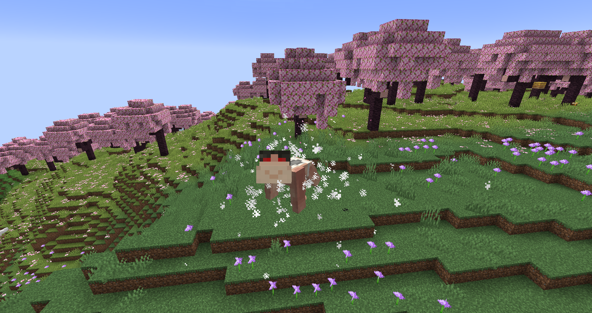

# Cart Mounts
There are three types of mounts, only equippable to the [Cart Titan](../titans/cart.md). They can be equipped in titan form if the Cart holds a mount and presses the spectatorOutlines key (it's unbound by default; check controls). Other players can equip mounts on the Cart Titan, but only the Cart can unqeuip them by sneaking and pressing the key again.

* ## Saddle Mount

The saddle mount lets up to two players ride on the Cart's back.

* ## Barrel Mount

The barrel mount gives the Cart Titan two barrels worth of extra storage, accessible only to the Cart with the spectatorOutlines key.

* ## Rifle Mount

The rifle mount attaches a heavy anti-titan rifle on the Cart's back. The rifle has a 1/4 chance to blow itself up on use, which probably won't kill the Cart, but it will completely destroy the mount.

### Commands
The cart mounts can be given with the usual /give command; i.e. `/give @s titan_shifter_megapack:titan_saddle_mount`.