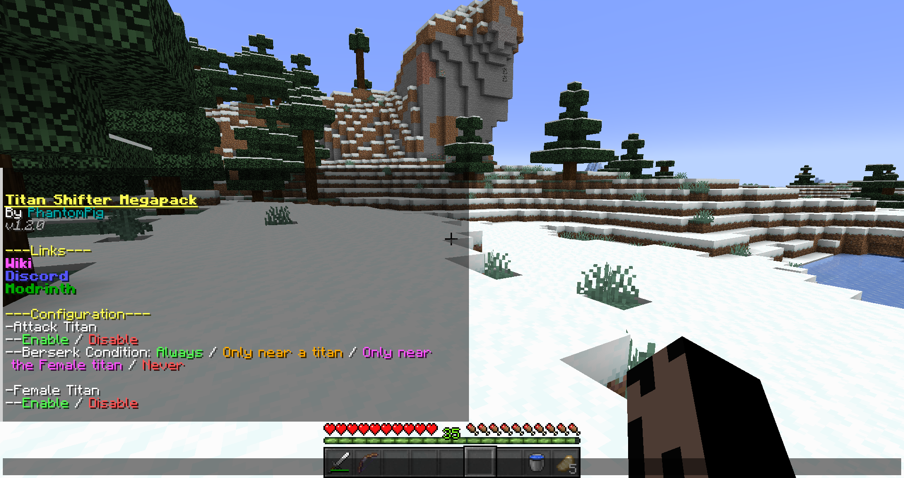

# Configuration
## Many aspects of the pack can be configured. If you have operator command permissions, you can open the configuration menu with `/function config:tsmp`.

In the menu, you can click to enable/disable each titan from being selected in the Origin menu, as well as change elements like the [Colossal's nuke](../titans/colossal.md), the chance for the [Cart's rifle](./cart_mounts.md) to break, and whether or not [Royal Blood](./royal_blood.md) is permanent.

More configuration options can be seen by scrolling.