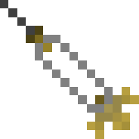
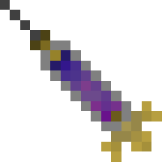
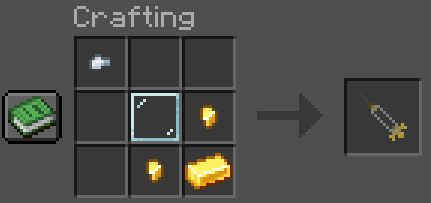

# Injections
Injections hold spinal fluid, and when one is injected into a living mob, it turns it into a [Pure Titan](./pure_titans.md). Some qualities of the source fluid is transferred into the Pure, e.g. [Attack Titan](../titans/attack.md) spinal fluid will make stronger Pures, [Colossal Titan](../titans/colossal.md) spinal fluid will make bigger Pures, and so on.

### Spinal Fluid
Spinal fluid can be taken from any __transformed__ titan by simply right-clicking them with an empty injection. If you yourself are transformed (not as a Pure) and want to take your own spinal fluid, you can shift-right click an empty injection.
To transform something, just right-click it with a filled injection. You can also use an injection on yourself by shift-right clicking it (**be careful!!!**).

### Obtaining

### Commands
You can use the command `/function phantom:give/injection/<type>` to give yourself an injection of the specified type.