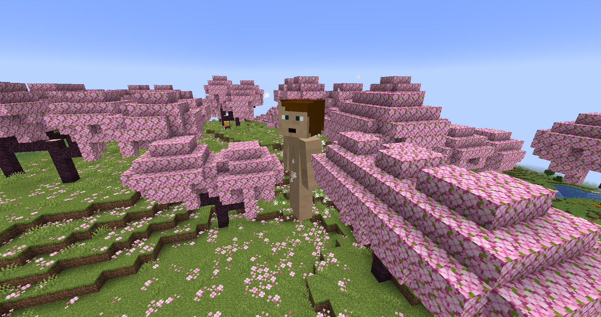
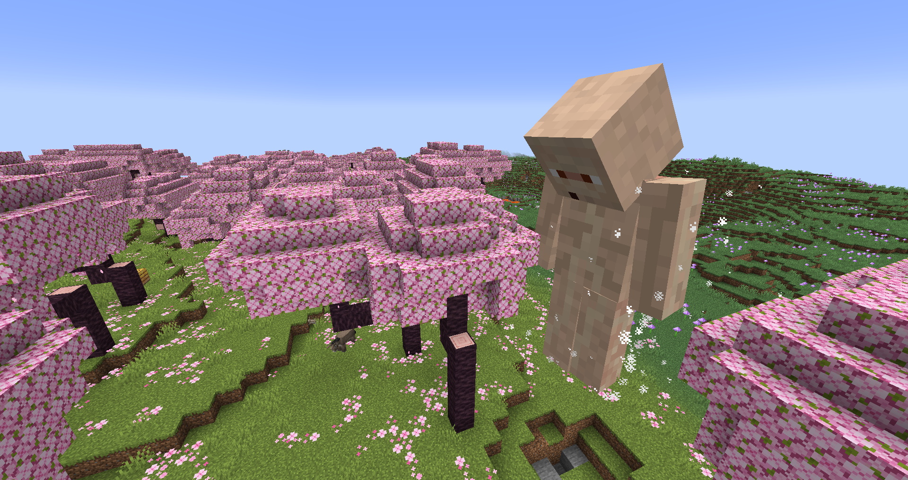
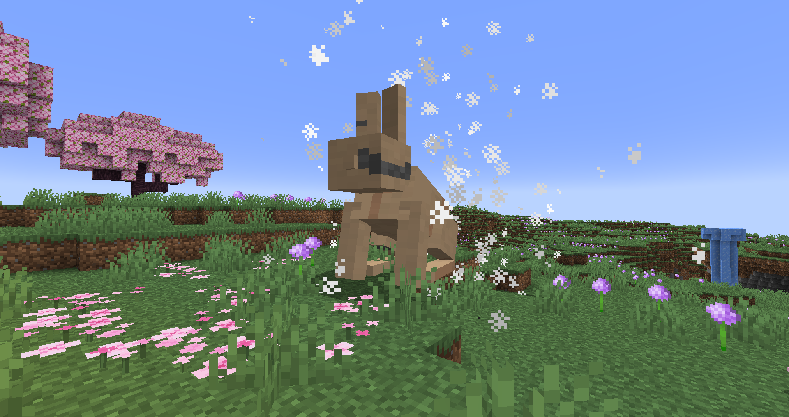

# Pure Titans
Pure titans are (mostly) mindless entities that server one purpse: to hunt and kill players.

Any living mob can be transformed into a Pure, including players (in which case, the player will lose control over their keyboard ([THIS IS DISABLED BY DEFAULT](./config.md)) and only be able to aim and move forward).

By default, Pures will untransform (most likely dying; it's pretty hard to survive untransforming) when they eat (kill) any living thing. This can be changed to either any player or only Titan Shifters (in human form; this goes well with Titan Stealing).

### Creation
Pures can be created with an [injection](./injections.md) or via the [Founding Titan](../titans/founding.md).

### Commands
You can directly transform an entity into a Pure (slight transforming delay included) with `/power grant <entity> phantom:assign/pure_shift`. Remember, Shifters can't be turned into Pures no matter what.