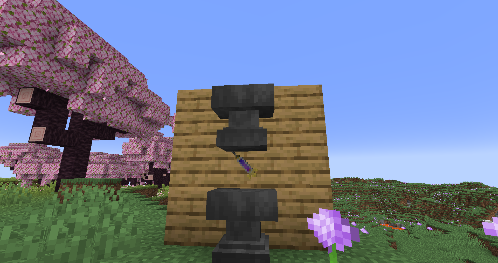

# Royal Blood
Royal Blood is a liquid, stored in a bottle, that gives some Shifters (namely the [Beast Titan](../titans/beast.md) and [Founding Titan](../titans/founding.md)) extra abilities.

### Obtaining
To get Royal Blood, you need to press an [Injection](./injections.md) between two anvils. This will destroy the spinal fluid inside but have a 1% chance to spawn Royal Blood. This also has a 10% chance to damage the anvils used.

### Commands
You can use the command `/function phantom:give/royal_blood` to give yourself a bottle of Royal Blood.