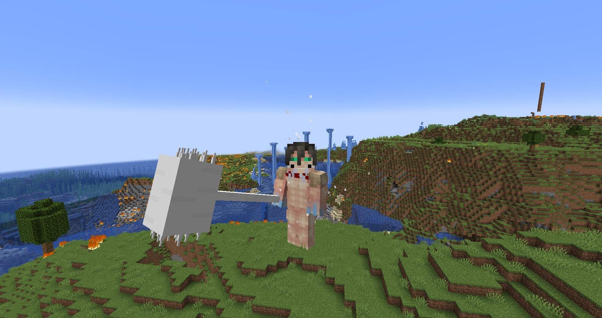

# Titan Stacking

When [Titan Stealing](./titan_stealing.md) is enabled in the [config](./config.md), Stacking is enabled by default.

When a Shifter with more than one titan is killed (and therefore when they're eaten), they'll lose their stacks ([configurable](./config.md)), making it possible to consilidate every titan into one Shifter but also easy to split them again. As an example, if the Attack Titan eats the Armored Titan who also holds the Beast Titan, the Attack will **only** gain the Armored stack, **not** the Beast, which will go back to the titan selection Origin menu.

With operator commands, you can give yourself a stack by running `/tag @s add TSMP.stack.<titan>` (keep in mind the Armored's stack tag is "armor", not "armored"). Doing this does not need stealable titans enabled nor will it remove the titan from the Origins menu.

### Stacks with active abilities can be activated with the hotbar slot key corresponding to that titan in the Origins menu, e.g. the Attack uses "1", the Armored uses "3", and so on.

## Stacks:

* ### Attack - 1
The Attack stack gives the shifter the ability to harden its knuckles, as described in the [Attack's power description](../titans/attack.md), but only for eight or six punches (instead of ten or eight) depending on the user's current shift.

* ### Female - 2
The Female stack gives a titan 1.5 extra motion points and 15 seconds of speed II upon transforming. It also lets the shifter attack faster in titan form, just like the [Female](../titans/female.md) can.

* ### Armored - 3
The Armored stack grants a titan 2 extra defense points, as well as a weaker variant of the Armored's charge ability. It also gives the titan visual spikes on its shoulders.

* ### Beast - 4
The Beast stack lets the user hurl a few scatter-shot rocks (when not sneaking) and scream (when sneaking) like the [Beast](../titans/beast.md) can.

* ### Warhammer - 5
The Warhammer stack grants a titan the [Warhammer's generation ability](../titans/warhammer.md) as is. It also grants a small Warhammer-esque overlay on the top front of a titan's chest and neck.

* ### Jaw - 6
The Jaw stack gives a titan 1 extra motion point, half an extra attack point, and the ability to climb walls when sneaking.

* ### Cart - 7
The Cart stack gives an shifter 1 extra motion point, 10 seconds of speed I upon transforming, a 50% chance to not gain a shift when shifting (unless it's the titan's first shift), and increased energy regeneration speeds.

* ### Colossal - 8
The Colossal stack makes a titan 6 blocks bigger and gives it a steam blast ability that, when used (not held, which is unlike the [Colossal's steam](../titans/colossal.md)), burns and launches away any visible entities within a 50 block radius.

* ### Founding - 9
The Founding stack gives a shifter the [Founding's mass pure transform ability](../titans/founding.md) as is, but only when the shifter has [Royal Blood](./royal_blood.md).

_The Attack Titan with a Warhammer and Armored stack, as well as with its own hardened fists_