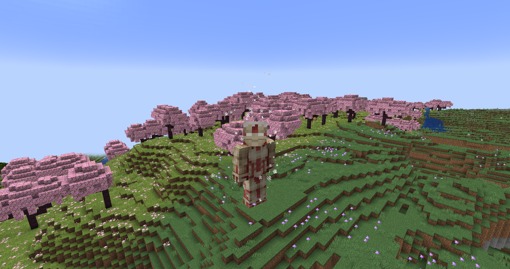

# Armored Titan
**"As the most defensive of the Nine Titans, the Armored Titan is a slow, lumbering, heavy-hitting giant — until it decides to shed away some of its armor."**

## Stats
* __Max Shifts__: 2
* __Height__: 15, 15
* __Speed__: 1.5, 2
* __Strength__: 12, 8
* __Health__: 2, 1.7
* __Defense__: 5, 3
* __Durability__: 18
* __Minutes between shifts__: 1, 3
* __Average minutes__ __to__ __regain__ __a shift__: 7.5

## Unique Abilities
* ### Armor Shed
In titan form, you can shed the armor around your limbs' joints to increase your movement speed, but in turn lowering your defense and damage.
* ### Charge
After sheding your armor in titan form, you can charge forward, sprinting at whatever is in front of you and smashing it to pieces.
* ### Half-Shifted Hands
In human form, you can partially shift to generate a pair of titan hands that can shield you and anything nearby from harm.
* ### Last Resort
If you're about to die, you can spread your consciousness throughout your titan's nervous system to stay alive at the cost of all of your movement.