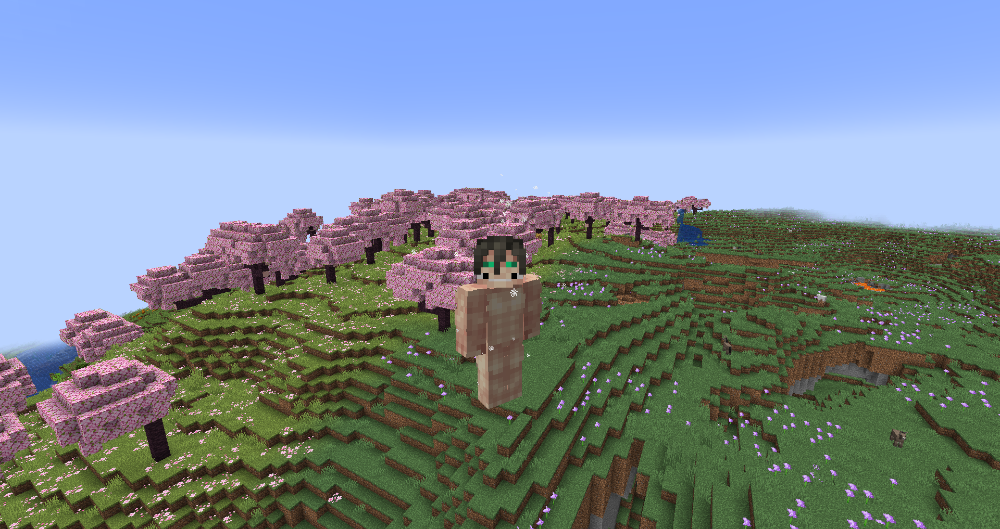

# Attack Titan
**"As the fiercest out of the Nine Titans, the Attack Titan has an overwhelming urge to fight for what's right — and its inheritor won't stop fighting until the day they die."**

## Stats
* __Max Shifts__: 3
* __Height__: 15, 14, 8
* __Speed__: 3, 2.5, 0.1
* __Strength__: 10, 8, 3
* __Health__: 2, 1.7, 1.3
* __Defense__: 1
* __Durability__: 12
* __Minutes between shifts__: 0.25, 3, 5
* __Minutes__ __to__ __regain__ __a shift__: 2.5

## Unique Abilities
* ### Hardened Knuckles
In titan form, you can harden your knuckles and hands to deal 50% extra damage for your next few punches. On your first shift, you'll get ten hardened punches, but on your second, you'll only get eight. Punching mobs or non-Titans won't use a punch. Punching anything armored will count as an extra punch, so hitting the Armored Titan, for example, will use two punches. With your knuckles hardened, you can also sneak and punch to cause a mini explosion, using two punches in the process.
* ### Crystal Harden
In titan form, you can perform a special type of untransformation that hardens your old titan body into a permanent, dense, skeleton-filled crystal.
* ### Berserk Rage
If you die in titan form while near a transformed Female Titan ([configurable](../misc/config.md)), you'll go berserk, creating a huge, fiery explosion in the process. In berserk mode, you are constantly on fire, immune to fire damage, smaller, have higher speed and strength, but lower health. You cannot untransform in berserk mode, but after 50 seconds, you'll be ejected, gaining debuffs, lowering your energy, and leaving behind a charred skeleton.
* ### Incomplete Transformation
Your third shift is a weak, immobile, half-shifted version of your titan body, with minimal health, strength, and size.

