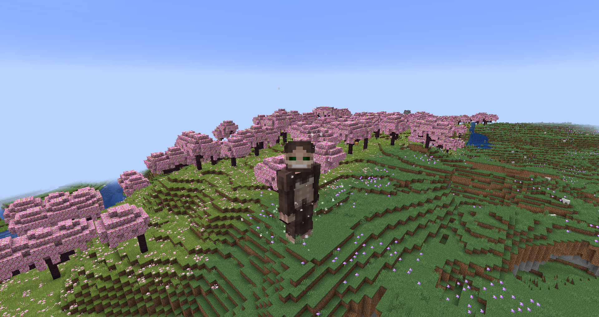

# Beast Titan
**"As the best thrower out of the Nine Titans, the Beast Titan can raze any particular area in mere seconds just by chucking a few rocks."**

## Stats
* __Max Shifts__: 4
* __Height__: 17, 16.6, 16, 15.4
* __Speed__: 2.5, 2.3, 2, 1.9
* __Strength__: 8, 7, 6.5, 6
* __Health__: 2, 1.9, 1.8, 1.7
* __Defense__: 1.3, 1.2, 1.1, 1
* __Durability__: 20
* __Minutes between shifts__: 0.5, 3, 5
* __Average minutes__ __to__ __regain__ __a shift__: 7

## Unique Abilities
* ### Precise Pitcher
In titan form, you can pull a boulder out of the earth and hurl it with great accuracy. When one of these lands, it will exploding the surrounding terrain.
* ### Rock Shotgun
Your titan can grab a boulder from the ground, crush it up, and hurl those smaller, remaining rocks towards a target at rapid speeds.
* ### Scream
While [Royal Blood](../misc/royal_blood.md) is active, you can scream, causing any humans injected with your titan's spinal fluid to transform into Pure Titans.