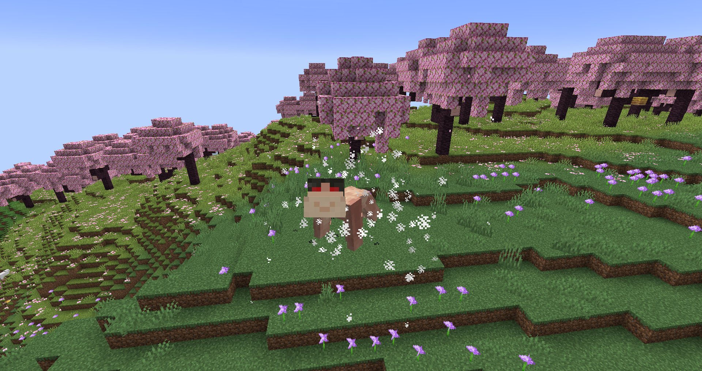
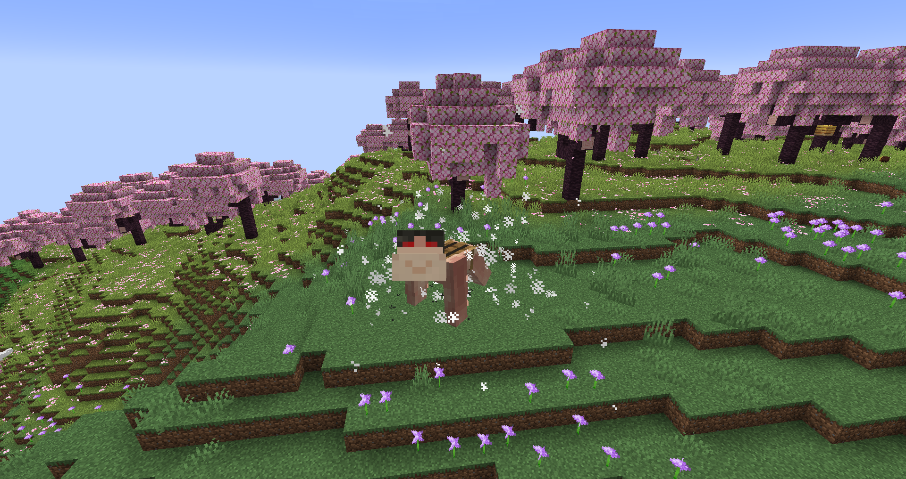
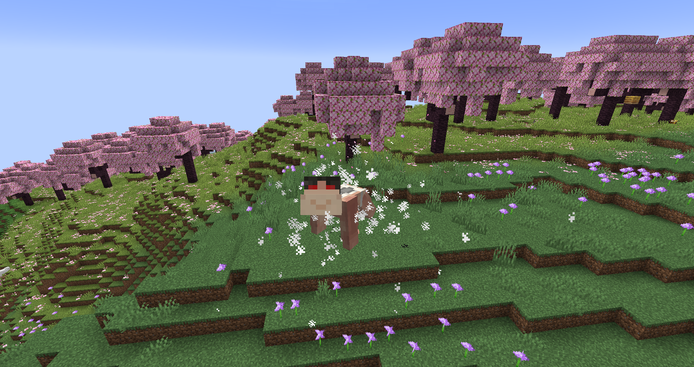

# Cart Titan
**"As a transportation and military unit, the Cart Titan does not excel at hand-to-hand combat, but instead can be outfitted with multiple forms of tactical gear. However, its extreme durability makes up for its below-average strength."**

## Stats
* __Max Shifts__: 30
* __Height__: 4
* __Speed__: 5
* __Strength__: 2
* __Health__: 3
* __Defense__: 1
* __Durability__: 500%
* __Seconds between shifts__: 5 (on normal ejection terms)
* __Average minutes__ __to__ __regain__ __a shift__: 1

## Unique Abilities
* ### Stamina Drawbacks
You heal twice as slow as other shifters because you spend that energy to stay in titan form for longer and to replenish your titan faster when in human form.
* ### Mounts
There are three [mounts](../misc/cart_mounts.md) you can use in titan form: the saddle mount, which lets other players ride on your back, the barrel mount, which gives you two personal barrels worth of storage on your back, and the rifle mount, which attaches a heavy anti-titan rifle on you. The rifle has a 1/4 chance to blow itself up on use, which probably won't kill you, but it will completely destroy the mount.