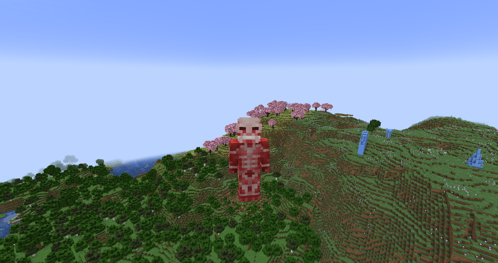

# Colossal Titan
**"A literal god of destruction, capable of comitting mass murder and detonating an extreme energy blast with a thought, the Colossal Titan is, put simply, a ticking time bomb — don't get on the inheritor's bad side."**

## Stats
* __Max Shifts__: 1
* __Height__: 60
* __Speed__: 1
* __Strength__: 30
* __Health__: 3
* __Defense__: 15
* __Durability__: 3
* __Minutes between shifts__: 5
* __Average minutes__ __to__ __regain__ __a shift__: 5

## Unique Abilities
* ### "Because this world..."
__"...is just...__

__...that cruel."__

You can choose to let out a massive amount of energy upon transforming, creating a blast comparable to that of a nuclear bomb.
* ### "You fought well..."
"...right up to the end."
You can rapidly emit steam from your titan body to ignite and fling away any entities nearby.
* ### Dissipate
You can evaporate your entire titan body at once to make it disappear, the only trace left behind being a few large puffs of smoke.
* ### Colossal Punch
In titan form, your punch is so huge it will create an explosion on impact.