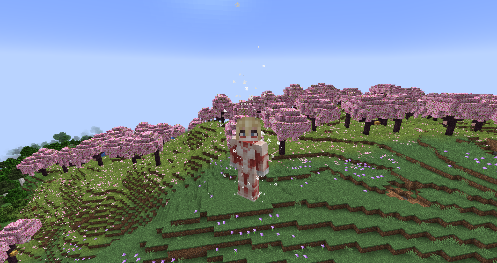
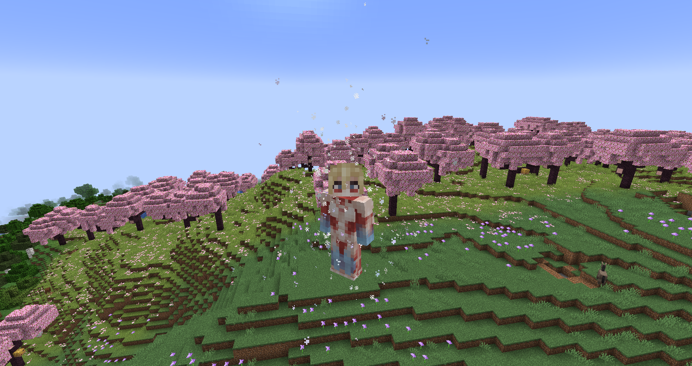

# Female Titan
**"As one of the fastest of the Nine Titans, the Female Titan can quickly catch up to its prey. This immensive speed comes with a few drawbacks, though."**

## Stats
* __Max Shifts__: 2
* __Height__: 14, 13.5
* __Speed__: 4, 3.75
* __Strength__: 6.5, 5
* __Health__: 1.7, 1.5
* __Defense__: 1
* __Durability__: 21
* __Minutes between shifts__: 0.25, 2
* __Minutes__ __to__ __regain__ __a shift__: 2

## Unique Abilities
* ### Indestructable Crystal
In human form, you can create an indestructible crystal around you that blocks most damage. Upon exiting the crystal, you'll receive negative effects.
* ### Titan Hardening
In titan form, you can harden the flesh around your knees and fists to increase attack and defense, but slightly decrease mobility. This hardening lasts for 90 seconds, and can only be used once per shift.
* ### Unique Combat
In titan form, you can punch faster than other titans.