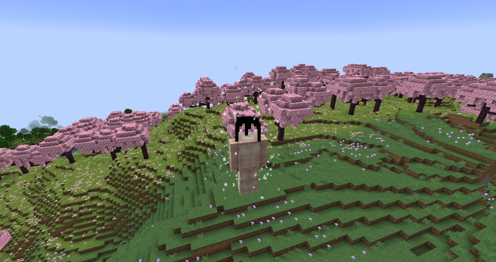
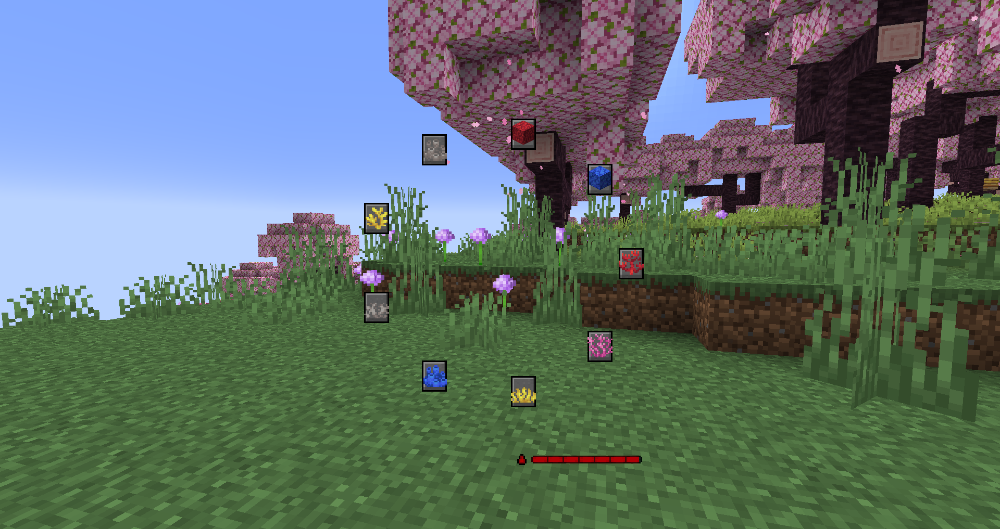

# Founding Titan
**"The one and only Founding Titan. Though this Titan may not seem all too powerful on the outside, it has the potential to outperform any other Subject of Ymir, for their paths all converge at this coordinate."**

## Stats
* __Max Shifts__: 5
* __Height__: 13, 12.5, 12, 11.5, 11
* __Speed__: 2.3, 2.3, 2, 2, 1.8
* __Strength__: 4.5, 4, 3.5, 3, 2.75
* __Health__: 2, 1.8, 1.6, 1.4, 1.4
* __Defense__: 1.2, 1.1, 1, 1, 0.9
* __Durability__: 20
* __Minutes between shifts__: 0.5, 3, 4, 5
* __Minutes__ __to__ __regain__ __a shift__: 3.5

## Unique Abilities
* ### Coordinate Convergence
With [Royal Blood](../misc/royal_blood.md) active, you can transform into any titan you see fit for your current situation.
* ### Safe Ejection
Instead of force ejecting upon low stamina (hunger) like the other shifters, you are force ejected from your titan when below 15% health, which comes with a lesser punishment than if you had been force ejected from your titan from dying.
* ### Titan Facade
Your titan form barely shows signs of weariness as you use it more and more, though it can still get slightly weaker and slower with each shift.
* ### Ymir's Power
While [Royal Blood](../misc/royal_blood.md) is active, you can transform any entity you see into a [Pure Titan](../misc/pure_titans.md).