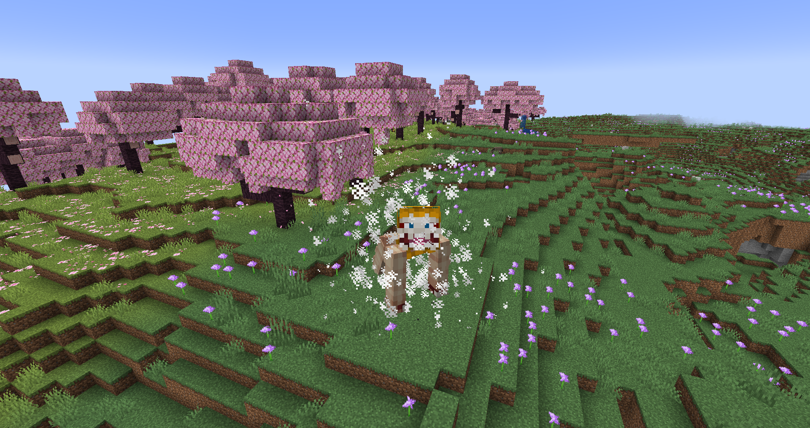
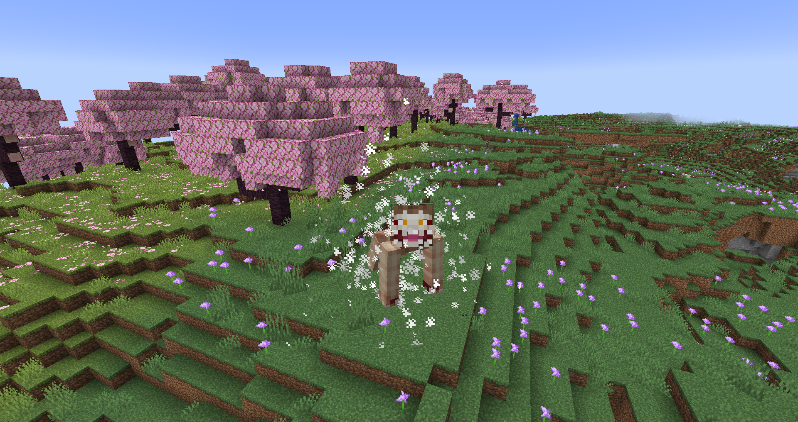
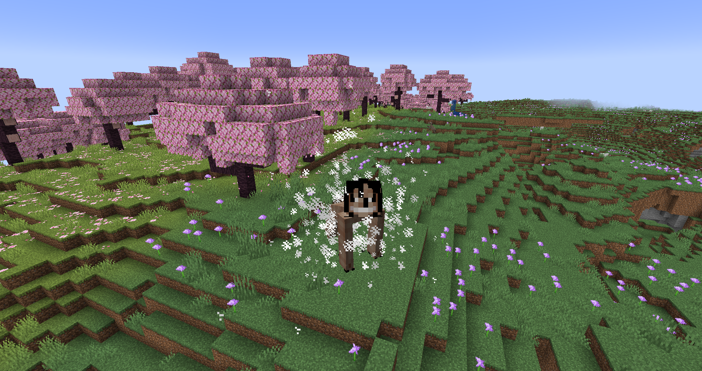
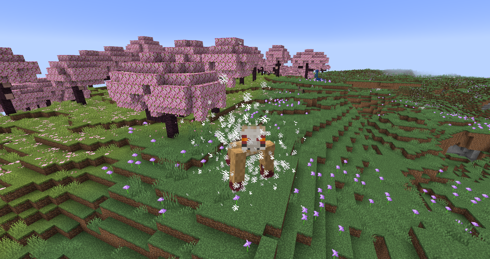

# Jaw Titan
**"As the most mobility-oriented Titan possible, the Jaw Titan can out manuever any other Titan on the battlefield. Its small stature and razer-sharp claws and teeth combine with this fact to result in a formidable opponent."**

## Stats
* __Max Shifts__: 2
* __Height__: 5, 5
* __Speed__: 5, 4.5
* __Strength__: 7, 5
* __Health__: 1.5, 1.3
* __Defense__: 1
* __Durability__: 21
* __Minutes between shifts__: 0.25, 2
* __Minutes__ __to__ __regain__ __a shift__: 2.25

## Unique Abilities
* ### Form Flexibility
Your Titan form can change when different spinal fluid is injected into your human body (Plated, Savage, and Beast variants; more details in-game).
* ### Claws
The Plated and Savage Jaws can use their nails to climb up walls. The Savage can also climb on ceilings.
* ### Limited
Despite being incredibly agile, your Titan is greatly slowed down in water.