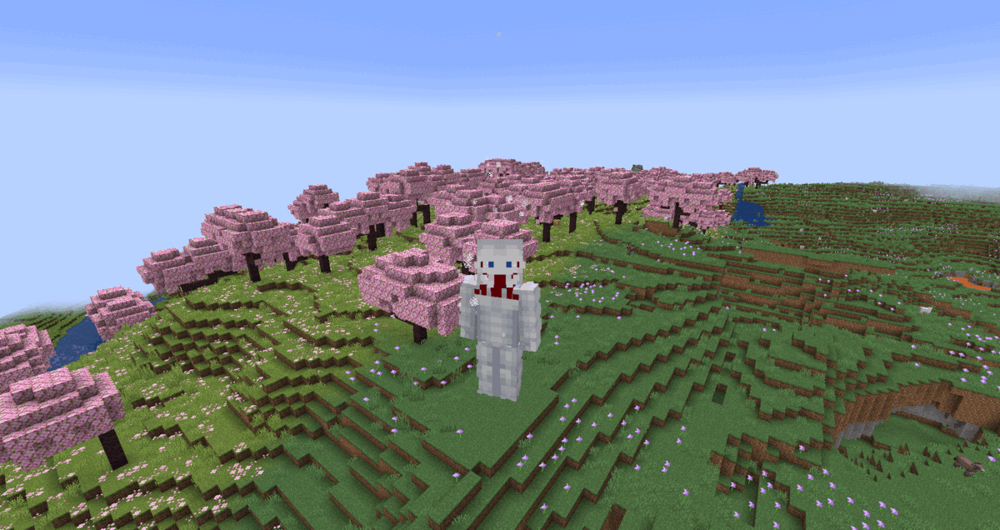

# Warhammer Titan
**"The 'architect' of the Nine Titans — capable of manifesting giant, titan versions of ordinary weapons at will, the Warhammer Titan is truly a worthy foe to even the most skilled of Titan Shifters."**

## Stats
* __Max Shifts__: 3
* __Height__: 15, 14, 13
* __Speed__: 2.5, 2.25, 2.1
* __Strength__: 5, 4.5, 4
* __Health__: 2, 1.9, 1.7
* __Defense__: 1.5, 1.3, 1.25
* __Durability__: 18
* __Minutes between shifts__: 0.25, 3, 5
* __Minutes__ __to__ __regain__ __a shift__: 4

## Unique Abilities
* ### Hardening
In titan form, you can manifest titan-sized weapons or structures to aid you in combat, earning you the title of "architect". Be careful not to overuse this ability, as it can rapidly drain hunger.
* ### Remote Operation
In titan form, you can place down a near-indestructable crystal containing your humanoid body, while maintaining consciousness in your titan form. Due to the cable connecting your titan body and the crystal, you won't be able to travel over 100 blocks away from it. Upon any untransformation, you'll find yourself inside of the crystal.